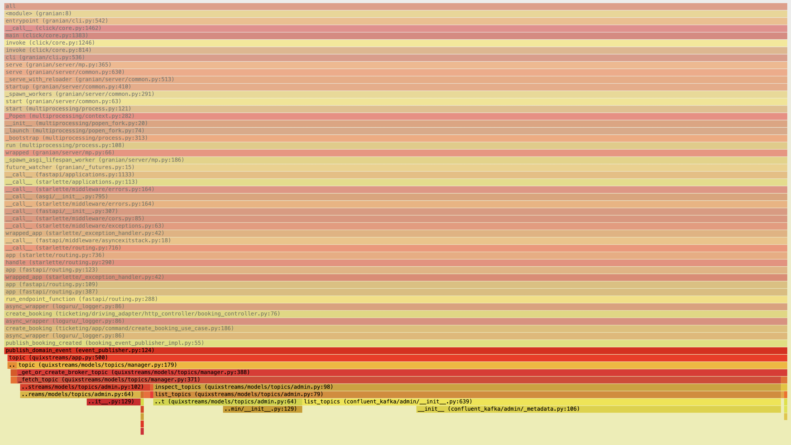
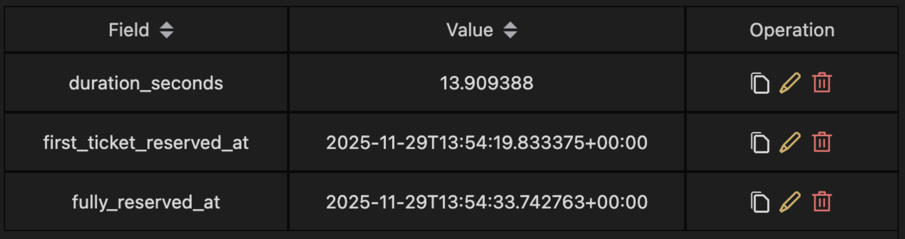
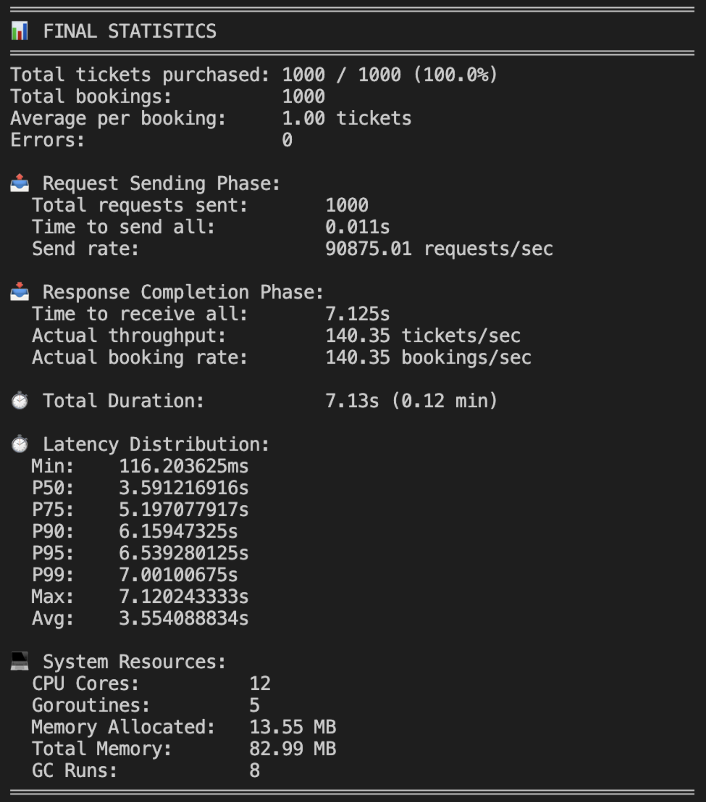
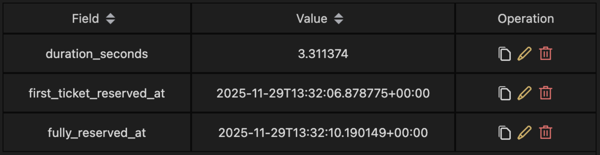
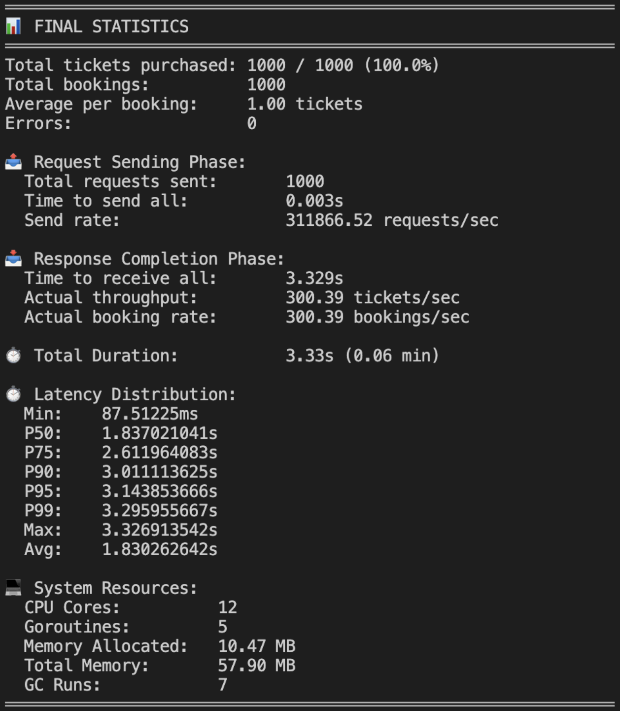
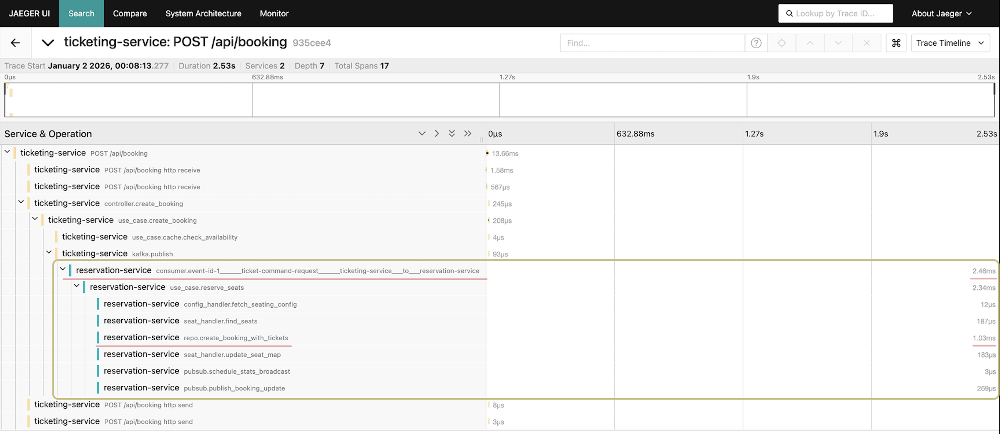
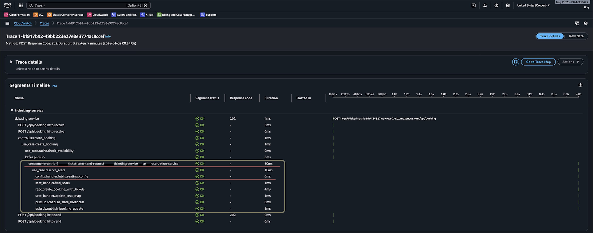
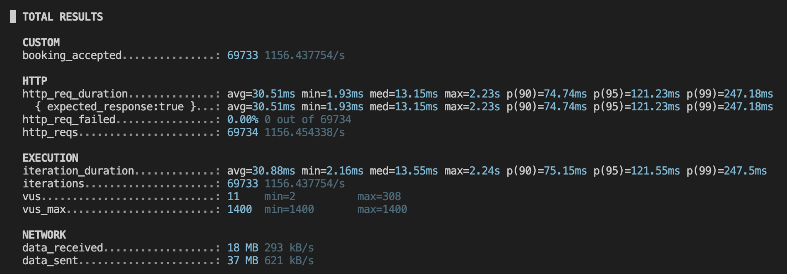
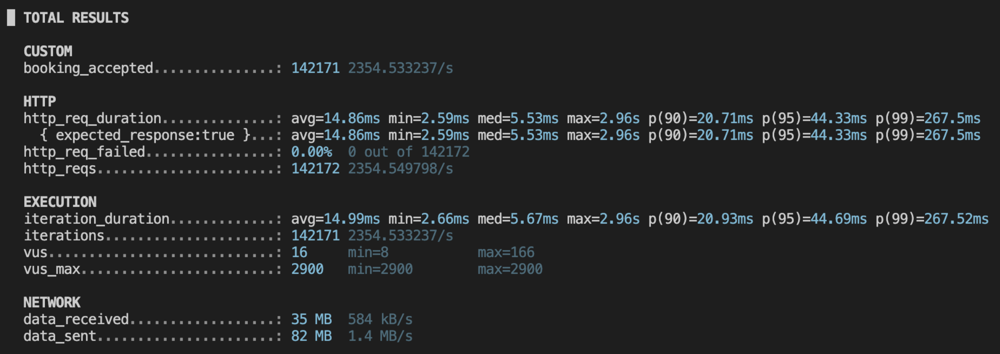
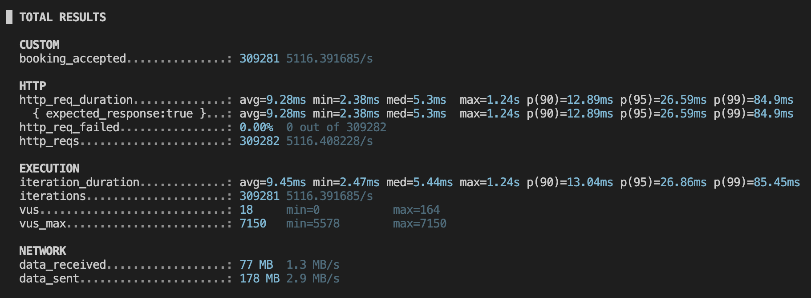

# Ticketing System

## Project Highlights

- Designed and implemented an **event-driven ticketing system** achieving **5,116 RPS** under load testing
- Leveraged **Kafka partition ordering** + **idempotency design** to achieve consistency without distributed locks
- Implemented **async booking notification** via SSE + Pub/Sub: API returns `202 Accepted` immediately, client receives real-time status updates
- Integrated **OpenTelemetry** with **Jaeger (local)** and AWS **X-Ray (cloud)** for distributed tracing
- Used **py-spy** to generate flame graphs, identified and resolved CPU bottlenecks in the hot path, reducing execution time by **72%**

---

## Project Goal

This project demonstrates a **Lock-Free Architecture** using **Kafka Partition** and **Consumer Group** characteristics to ensure data consistency under high concurrency without traditional distributed locks.

> **Note:** The following features are excluded from the scope:
>
> - Payment Processing
> - Timeout-based Cancellations

---

## Table of Contents

- [System Architecture](#system-architecture)
  - [Tech Stack](#tech-stack)
- [Idempotency Design](#idempotency-design)
  - [Kafka Partition Ordering](#1-kafka-partition-ordering)
  - [Idempotent Operations](#2-idempotent-operations)
- [Observability](#observability)
  - [Distributed Tracing: OpenTelemetry](#distributed-tracing-opentelemetry)
  - [CPU Profiling: py-spy](#cpu-profiling-py-spy)
- [Performance Testing](#performance-testing)
  - [Test Environment](#test-environment)
  - [Spike Test (Go)](#spike-test-go)
    - [Environment Comparison](#environment-comparison)
    - [Volume Scaling](#volume-scaling)
    - [CPU Scaling](#cpu-scaling)
    - [Distributed Tracing Analysis](#distributed-tracing-analysis)
  - [Load Test (k6)](#load-test-k6)
    - [Local](#local)
    - [ECS (10i/20vCPU)](#ecs-10i20vcpu)
    - [ECS (25i/50vCPU)](#ecs-25i50vcpu)
    - [Performance Comparison](#performance-comparison)

---

## System Architecture

```
┌────────┐      ┌─────────┐      ┌───────────────────┐      ┌─────────────┐      ┌─────────────────────┐
│ Client │─────▶│   ALB   │─────▶│ Ticketing Service │─────▶│    Kafka    │─────▶│ Reservation Service │
└────────┘      └─────────┘      │       (ECS)       │      │    (EC2)    │      │       (ECS)         │
                                 └─────────┬─────────┘      └─────────────┘      └──────────┬──────────┘
                                           │                                                │
                                           └───────────────────────┬────────────────────────┘
                                                                   │
                                                         ┌─────────┴─────────┐
                                                         ▼                   ▼
                                                  ┌────────────┐       ┌───────────┐
                                                  │ PostgreSQL │       │  Kvrocks  │
                                                  │   (RDS)    │       │   (EC2)   │
                                                  └────────────┘       └───────────┘
```

### Tech Stack

| Category           | Technology                         | Purpose                                 |
| ------------------ | ---------------------------------- | --------------------------------------- |
| **Language**       | Python 3.13                        | Runtime                                 |
| **Web Framework**  | FastAPI + Granian + uvloop         | High-performance async API              |
| **Database**       | RDS PostgreSQL                     | Persistent storage                      |
| **Message Broker** | Kafka                              | Event streaming, At-Least-Once delivery |
| **Cache/State**    | Kvrocks (RocksDB + Redis protocol) | Seat bitmap, Pub/Sub                    |
| **Cloud**          | AWS (ECS, ALB, CDK)                | Infrastructure                          |
| **Observability**  | OpenTelemetry + Jaeger / X-Ray     | Distributed tracing                     |
| **Profiling**      | py-spy                             | CPU flame graph analysis                |

> **Why Kvrocks over Redis?**
> While Redis can be configured with `appendfsync always` to prevent data loss, the official documentation marks it as "very very slow," and benchmarks show 500+ times performance degradation (write latency increases from 32μs to 18ms). The default `everysec` strategy may lose up to 1 second of data on crashes. Kvrocks is built on RocksDB's LSM-tree architecture, optimized for sequential disk writes, maintaining acceptable performance while ensuring WAL-based synchronous durability—making it more suitable for seat bitmap state under at-least-once event delivery (see [Kvrocks vs Redis Benchmark](https://github.com/apache/kvrocks/discussions/389)).
>
> _Reference: [Redis Persistence](https://redis.io/docs/latest/operate/oss_and_stack/management/persistence/), [Redis Performance Comparison](https://medium.com/@krittaboon.t/persistance-in-redis-931768face32), [RocksDB Write-Ahead Log](<https://github.com/facebook/rocksdb/wiki/Write-Ahead-Log-(WAL)>)_

---

## Idempotency Design

Idempotency is ensured through two key designs:

1. **Kafka Partition Ordering** - Same partition is assigned to same consumer, ensuring sequential processing
2. **Idempotent Operations** - PostgreSQL status check + Kvrocks BITFIELD SET are both idempotent

### 1. Kafka Partition Ordering

Reserve/Release for the same section go to the same partition, guaranteeing sequential processing.

**Key**: Within the same Consumer Group, a partition is only assigned to one consumer at a time, ensuring sequential processing.

```
Topic: event-id-{event_id}______ticket-command-request______ (per event)
    │
    ▼
Partition: calculated from {section}-{subsection}
    │
    ▼
Same Partition → Same Consumer → Sequential Processing

Reserve A-1 (t=1) → Release A-1 (t=2) → Reserve A-1 (t=3)
                    ↑
                    Guaranteed to process after t=1
```

**Message Commit (Offset Commit)**:

- Consumer commits offset after processing message, confirming completion
- Crash before commit → message redelivered → requires idempotent operations

### 2. Idempotent Operations

```
SeatReservationUseCase.reserve_seats(request)
    │
    ├── [Step 1] Idempotency Check (PostgreSQL)
    │       ├── SELECT * FROM booking WHERE id = {booking_id}
    │       ├── PENDING_PAYMENT → skip to Step 4 (ensure Kvrocks complete)
    │       └── FAILED → return error
    │
    ├── [Step 2] Find Seats (Kvrocks Lua Script)
    │       ├── BEST_AVAILABLE: prioritize consecutive seats, fallback to largest blocks
    │       └── MANUAL: verify specified seats are AVAILABLE
    │
    ├── [Step 3] PostgreSQL Write (CTE Atomic)
    │       ├── INSERT booking (status=PENDING_PAYMENT)
    │       ├── UPDATE tickets SET status=RESERVED
    │       └── TRIGGER auto-update event.stats
    │
    └── [Step 4] Set Seats (Kvrocks)
            └── BITFIELD SET u1 seat_index 1 (idempotent: SET 1 = no-op)
```

#### PostgreSQL: Booking Status Check

booking_id (UUID7) is generated by Client, serving as the Idempotency Key.

```
SELECT * FROM booking WHERE id = {booking_id}
  │
  ├── Not exists → process normally
  ├── FAILED → return error (don't recreate)
  └── PENDING_PAYMENT → skip DB write, only complete Kvrocks
```

#### Kvrocks: BITFIELD SET

BITFIELD SET is an idempotent operation—repeated execution doesn't change the result.

```
BITFIELD SET u1 seat_index 1
  → Seat already 1? SET 1 = no-op (idempotent)

BITFIELD SET u1 seat_index 0
  → Seat already 0? SET 0 = no-op (idempotent)
```

---

## Observability

### Distributed Tracing: OpenTelemetry

Integrated **OpenTelemetry** for end-to-end distributed tracing across services (Local: Jaeger, AWS: X-Ray).

See [Distributed Tracing Analysis](#distributed-tracing-analysis) for trace examples comparing Local and Cloud performance.

### CPU Profiling: py-spy

Used **py-spy** to generate flame graphs and identify CPU bottlenecks in the API hot path.

### Bottleneck Identified



**Bottleneck call stack:**

```text
publish_domain_event()                                    33.84%
  └── app.topic()                                         33.70%  ← Called on every publish
        └── TopicManager.topic()                          33.29%
              └── _get_or_create_broker_topic()           33.29%
                    └── _fetch_topic()                    33.01%
                          └── inspect_topics()            27.12%
                                └── list_topics()         27.12%  ← Queries Kafka metadata
                                      └── AdminClient.list_topics()  20.68%
                                            └── __init__()            15.75%
```

| Rank | Function                      | Samples | CPU %      | Root Cause                             |
| ---- | ----------------------------- | ------- | ---------- | -------------------------------------- |
| 1    | `quixstreams/app.topic()`     | 246     | **33.70%** | Calls `list_topics()` on every publish |
| 2    | `list_topics()` (admin.py)    | 198     | **27.12%** | Queries Kafka cluster metadata         |
| 3    | `confluent_kafka list_topics` | 151     | **20.68%** | Underlying Kafka client call           |

### Fix Applied

**Root Cause:** `app.topic()` calls `list_topics()` on every publish to verify topic exists → expensive Kafka metadata query

**Solution:** Cache Topic objects after first creation

```python
# event_publisher.py - Topic caching
_quix_topic_object_cache: dict[str, Any] = {}

def _get_or_create_quix_topic_with_cache(topic_name: str):
    """Cache Topic objects to avoid repeated list_topics() calls (~34% CPU)"""
    if topic_name not in _quix_topic_object_cache:
        app = _get_quix_app()
        _quix_topic_object_cache[topic_name] = app.topic(
            name=topic_name,
            key_serializer='str',
            value_serializer='json',
        )
    return _quix_topic_object_cache[topic_name]
```

### Performance Validation (go-spike-test)

> **Architecture Note:** This system uses **Response-First** pattern. The API responds immediately after publishing to Kafka (`202 Accepted`), actual seat reservation and booking creation happen asynchronously via consumers.

#### Before Optimization





#### After Topic Caching





#### Performance Comparison

| Metric                  | Before | After Topic Cache | Improvement |
| ----------------------- | ------ | ----------------- | ----------- |
| **Sellout Duration** ¹  | 13.91s | 3.31s             | **76.2% ↓** |
| **Response Duration** ² | 7.13s  | 3.33s             | **53.3% ↓** |
| **P50**                 | 3.59s  | 1.84s             | **48.7% ↓** |
| **P95**                 | 6.54s  | 3.14s             | **52.0% ↓** |
| **P99**                 | 7.00s  | 3.30s             | **52.9% ↓** |
| **Throughput**          | 140/s  | 300/s             | **2.1× ↑**  |

> ¹ **Sellout Duration**: Time from first ticket reserved to all 1000 tickets sold (end-to-end, includes async consumer processing)
>
> ² **Response Duration**: Time for all 1000 HTTP requests to receive responses (API layer only)

---

## Performance Testing

### Test Environment

| Component           | Local (Apple M2 Max, 12 cores, 32 GB) | AWS Cloud                           |
| ------------------- | ------------------------------------- | ----------------------------------- |
| Ticketing Service   | 5 instances                           | ECS Fargate (2 vCPU, 4 GB)          |
| Reservation Service | 5 instances                           | ECS Fargate (2 vCPU, 4 GB)          |
| PostgreSQL          | Docker                                | RDS db.m8gd.2xlarge (8 vCPU, 32 GB) |
| Kafka               | Docker(3 brokers)                     | 3× c7g.large EC2 (2 vCPU, 4 GB)     |
| Kvrocks             | Docker                                | m6i.large EC2 (2 vCPU, 8 GB)        |

### Spike Test (Go)

Burst all requests simultaneously (fire-and-forget), measuring time to complete all seat reservations.

**Purpose**: Establish performance baseline and compare local vs cloud throughput.

**Test Config:**

- Each test ran 5 times, results averaged
- Reservation Service: **10 instances** (2 vCPU, 4 GB each)

#### Environment Comparison

**Purpose**: Compare Local vs Cloud, Single-AZ vs Multi-AZ performance impact.

**Condition**: 2,000 tickets, RDS m8gd.2xlarge
**Variable**: Deployment environment (Local / Single-AZ / Multi-AZ)

| Environment   | TPS  | vs Local | Duration | Test Records (s)         |
| ------------- | ---- | -------- | -------- | ------------------------ |
| Local         | 1504 | 100%     | 1.33s    | 1.29/1.33/1.39/1.27/1.35 |
| RDS Single-AZ | 866  | 58%      | 2.31s    | 2.29/2.30/2.34/2.35/2.29 |
| RDS Multi-AZ  | 580  | 39%      | 3.45s    | 3.51/3.38/3.47/3.41/3.46 |

#### Volume Scaling

**Purpose**: Verify TPS stability across different data volumes.

**Condition**: RDS Single-AZ m8gd.2xlarge
**Variable**: Concurrent requests (2K / 5K / 10K)

| Tickets | TPS | Duration | Test Records (s)              |
| ------- | --- | -------- | ----------------------------- |
| 2,000   | 866 | 2.31s    | 2.29/2.30/2.34/2.35/2.29      |
| 5,000   | 887 | 5.64s    | 5.56/5.60/5.74/5.55/5.73      |
| 10,000  | 888 | 11.26s   | 11.31/11.21/11.15/11.39/11.22 |

> TPS remains stable (~880) across different ticket volumes, confirming linear scalability.

#### CPU Scaling

**Purpose**: Determine if database CPU is the bottleneck.

**Condition**: 2,000 tickets, RDS Single-AZ
**Variable**: RDS instance type (4→8→16 vCPU)

| Instance                      | TPS | Duration | Test Records (s)         |
| ----------------------------- | --- | -------- | ------------------------ |
| m8gd.xlarge (4 vCPU, 16 GB)   | 810 | 2.47s    | 2.50/2.45/2.48/2.46/2.45 |
| m8gd.2xlarge (8 vCPU, 32 GB)  | 866 | 2.31s    | 2.29/2.30/2.34/2.35/2.29 |
| m8gd.4xlarge (16 vCPU, 64 GB) | 837 | 2.39s    | 2.35/2.40/2.41/2.38/2.41 |

> Doubling CPU (4→8→16 vCPU) shows no significant improvement — suggests bottleneck is network RTT, not database CPU.

#### Distributed Tracing Analysis

**Example Trace (Jaeger - Booking → Reservation, 2.53s):**



**Example Trace (X-Ray - Booking → Reservation, 3.8s):**



> These traces show the **longest operations** from the **2000 spike test** in Local (Jaeger, 2.53s) and Cloud (X-Ray, 3.8s) environments, comparing the **Reservation Service execution time differences** between the two environments.

Traces confirm the bottleneck is **network RTT**:

| Metric                               | Local  | Cloud | Δ     | Description                                 |
| ------------------------------------ | ------ | ----- | ----- | ------------------------------------------- |
| Total Trace                          | 2.53s  | 3.8s  | +50%  | End-to-end (API → Kafka → Consumer → DB)    |
| **reservation service end-to-end**   | 2.46ms | ~10ms | +307% | Consumer actual processing time             |
| **repo.create_booking_with_tickets** | 1.03ms | ~4ms  | +288% | PostgreSQL write (booking + tickets + stat) |

> **Insight**: Consumer processing ~10ms per message, but total trace shows 2.53s/3.8s due to **message backlog during spike test** (2000 concurrent requests queuing in Kafka)

**Key Findings:**

- **Network latency has significant impact** — Cloud TPS reduced by 42% (866 vs 1504); Multi-AZ costs additional 33% TPS (866→580); CPU scaling showed no improvement (810→866→837 TPS). Distributed tracing confirms network RTT as bottleneck: consumer processing +307% slower (2.46ms→10ms), DB writes +288% slower (1.03ms→4ms)

---

### Load Test (k6)

Sustained load over 60 seconds with gradual ramp-up, measuring maximum RPS at 0% error rate.

**Purpose**: Find maximum sustainable throughput while maintaining reliability.

**Condition**: RDS Single-AZ m8gd.2xlarge, 60s sustained load
**Variable**: Ticketing Service instances (5i / 10i / 25i)

**Test Config:**

- Ticketing Service: **5i** (Local) / **10i** / **25i** (2 vCPU, 4 GB each) — scaled with load
- Reservation Service: **10 instances** (2 vCPU, 4 GB each)

#### Local

| avg     | med     | p90     | p95      | p99      | max   |
| ------- | ------- | ------- | -------- | -------- | ----- |
| 30.51ms | 13.15ms | 74.74ms | 121.23ms | 247.18ms | 2.23s |



#### ECS (10i/20vCPU)

| avg     | med    | p90     | p95     | p99     | max   |
| ------- | ------ | ------- | ------- | ------- | ----- |
| 14.86ms | 5.53ms | 20.71ms | 44.33ms | 267.5ms | 2.96s |



#### ECS (25i/50vCPU)

| avg    | med   | p90     | p95     | p99    | max   |
| ------ | ----- | ------- | ------- | ------ | ----- |
| 9.28ms | 5.3ms | 12.89ms | 26.59ms | 84.9ms | 1.24s |



#### Performance Comparison

| Environment      | RPS   | avg     | med     | p90     | p95      | p99      | max   |
| ---------------- | ----- | ------- | ------- | ------- | -------- | -------- | ----- |
| Local            | 1,145 | 30.51ms | 13.15ms | 74.74ms | 121.23ms | 247.18ms | 2.23s |
| ECS (10i/20vCPU) | 2,355 | 14.86ms | 5.53ms  | 20.71ms | 44.33ms  | 267.5ms  | 2.96s |
| ECS (25i/50vCPU) | 5,116 | 9.28ms  | 5.3ms   | 12.89ms | 26.59ms  | 84.9ms   | 1.24s |
