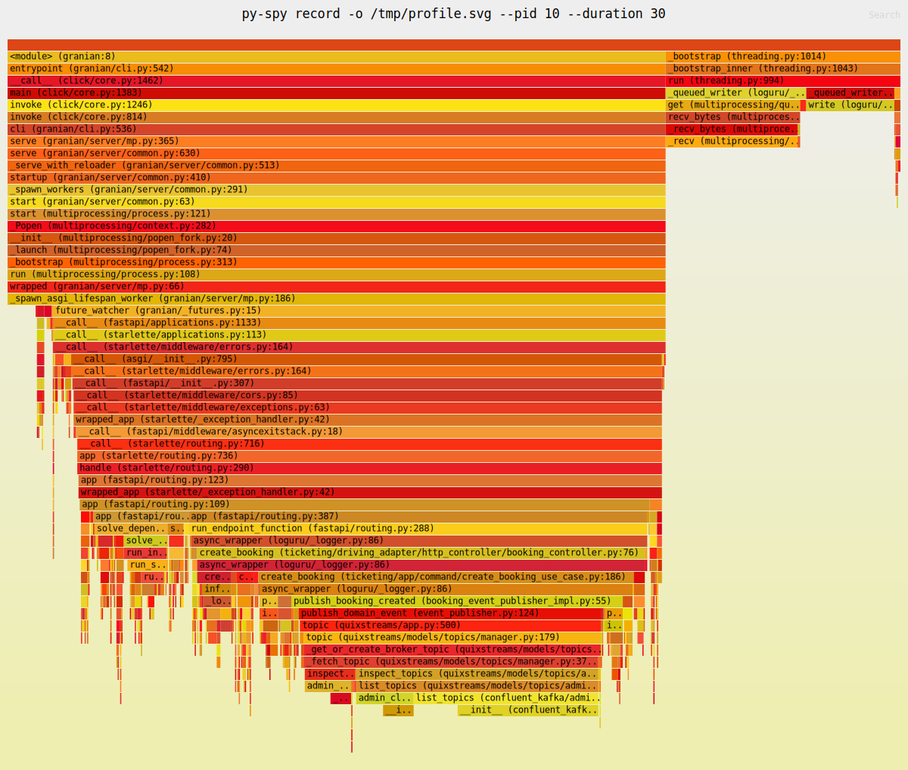

# Performance Tuning: Consumer Configuration

## Problem: High Latency from Producer to Consumer

During local development, I used **Jaeger** to observe system performance with a **spike test of 1000 concurrent requests**.

### Before: 10 Consumers × 0.5 CPU (Total: 5 CPU reserved)

```yaml
resources:
  limits:
    cpus: '1'
    memory: 1024M
  reservations:
    cpus: '0.5'
    memory: 512M
```

**Result (longest trace):** Producer → Consumer latency: **~11 seconds** (1.54s ~ 12.55s)


---

### After: 50 Consumers × 0.1 CPU (Total: 5 CPU reserved)

```yaml
resources:
  limits:
    cpus: '0.25'
    memory: 512M
  reservations:
    cpus: '0.1'
    memory: 128M
```

**Result (longest trace):** Producer → Consumer latency: **~1 second** (4.35s ~ 5.53s)


---

## Key Insight

| Metric | Before | After | Improvement |
|--------|--------|-------|-------------|
| Consumer count | 10 | 50 | 5× more |
| CPU per consumer | 0.5 | 0.1 | 5× less |
| Total CPU reserved | 5 | 5 | Same |
| Producer → Consumer latency | 11.01s | 1.18s | **89.3% faster** |
| Total sellout duration | 14.25s | 7.91s | **44.5% faster** |
| P50 latency | 2.98s | 3.80s | 27.5% slower |
| P95 latency | 5.87s | 6.87s | 17.0% slower |
| P99 latency | 6.73s | 7.82s | 16.2% slower |
| Throughput | 138.33/s | 119.66/s | 13.5% lower |

**Conclusion:** For I/O-bound Kafka consumers, **more lightweight consumers** outperform fewer heavyweight ones. The bottleneck was not CPU per consumer, but **parallelism** — having more consumers to process partitions concurrently dramatically reduced queue wait time.

### Why P95 is slower but total duration is faster?

| Factor | 10 Consumers × 0.5 CPU | 50 Consumers × 0.1 CPU |
|--------|------------------------|------------------------|
| Queue wait time | Long (messages pile up) | Short (more consumers polling) |
| Processing per request | Fast (more CPU) | Slightly slower (less CPU) |
| Parallelism | Low | High |

**Observation:** All latency percentiles (P50, P95, P99) are ~17-27% slower, and throughput dropped by 13.5%. Yet the total sellout duration improved by 44.5%.

**Possible causes:**

1. **Resource contention** - 50 containers competing for CPU/memory causes more context switching
2. **Docker scheduling overhead** - Managing 50 containers is more complex than 10
3. **Connection pool pressure** - More consumers = more concurrent connections to Kafka/Kvrocks/PostgreSQL

**Trade-off:** We sacrifice per-request latency to gain faster overall completion. For spike tests with 1000 concurrent requests, reducing the **backend processing time** (first ticket → last ticket) matters more than individual request speed.

---

## CPU Profiling with py-spy

Used **py-spy** to generate flame graphs and identify CPU bottlenecks in the API hot path.

### Setup

```dockerfile
# Dockerfile (development stage)
RUN uv sync --all-groups --frozen && \
    pip install py-spy
```

```yaml
# docker-compose.yml
ticketing-service:
  cap_add:
    - SYS_PTRACE  # Required for py-spy profiling
```

### Profiling Commands

```bash
# Enter container
docker exec -it <container> bash

# Find Python process
ps aux | grep python

# Generate flame graph (30 seconds sampling)
py-spy record -o /tmp/profile_$(date +%Y%m%d_%H%M%S).svg --pid <PID> --duration 30

# Copy out
docker cp <container>:/tmp/profile_*.svg ./observability/profiling/
```

### Bottlenecks Identified (from Flame Graph - Before Fix)



**Biggest bottleneck call stack:**

```text
publish_domain_event()                                    33.84%
  └── app.topic()                                         33.70%  ← Called on every publish
        └── TopicManager.topic()                          33.29%
              └── _get_or_create_broker_topic()           33.29%
                    └── _fetch_topic()                    33.01%
                          └── inspect_topics()            27.12%
                                └── list_topics()         27.12%  ← Queries Kafka metadata
                                      └── AdminClient.list_topics()  20.68%
                                            └── __init__()            15.75%
```

| Rank | Function | Samples | CPU % | Root Cause |
|------|----------|---------|-------|------------|
| 1 | `quixstreams/app.topic()` | 246 | **33.70%** | Calls `list_topics()` on every publish |
| 2 | `list_topics()` (admin.py) | 198 | **27.12%** | Queries Kafka cluster metadata |
| 3 | `confluent_kafka list_topics` | 151 | **20.68%** | Underlying Kafka client call |
| 4 | `loguru/_handler.py:_queued_writer` | 115 | **15.75%** | Log queue processing |
| 5 | `loguru/_file_sink.py:write` | 72 | **9.86%** | File I/O blocking |

### Fixes Applied

| Bottleneck | CPU % | Fix | Result |
|------------|-------|-----|--------|
| `app.topic()` | ~34% | Cache Topic objects in `_quix_topic_object_cache` | Eliminates repeated `list_topics()` calls |
| File logging | ~25% | Disable file sink in production (`DEBUG=false`) | Use stdout only, collected by CloudWatch/Docker logs |

### Implementation

```python
# event_publisher.py - Topic caching
_quix_topic_object_cache: dict[str, Any] = {}

def _get_or_create_quix_topic_with_cache(topic_name: str):
    """Cache Topic objects to avoid repeated list_topics() calls (~34% CPU)"""
    if topic_name not in _quix_topic_object_cache:
        app = _get_quix_app()
        _quix_topic_object_cache[topic_name] = app.topic(
            name=topic_name,
            key_serializer='str',
            value_serializer='json',
        )
    return _quix_topic_object_cache[topic_name]
```

```python
# loguru_io_config.py - Conditional file logging
if settings.DEBUG or os.environ.get('ENABLE_FILE_LOGGING'):
    custom_logger.add(file_sink, ...)  # Only in development
```

### Architecture Decision

- **Development**: `DEBUG=true` enables file logging for convenience
- **Production**: `DEBUG=false` uses stdout only, collected by CloudWatch/Docker logs

This separation ensures production performance while maintaining development convenience.
