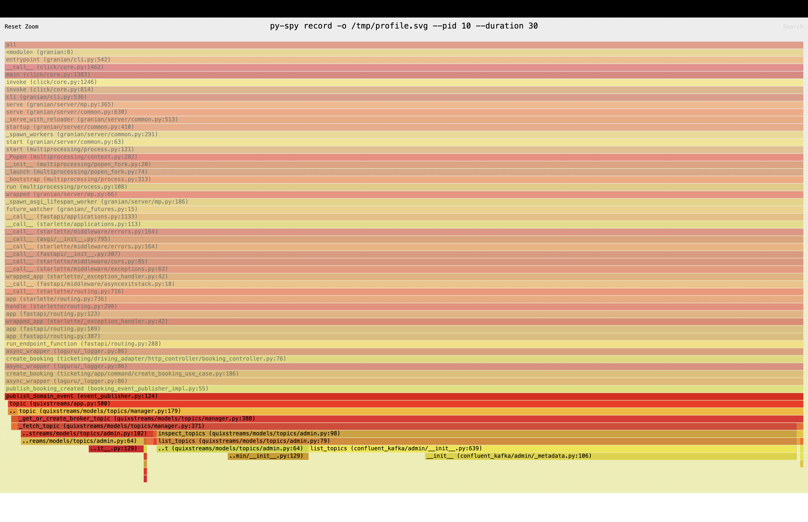
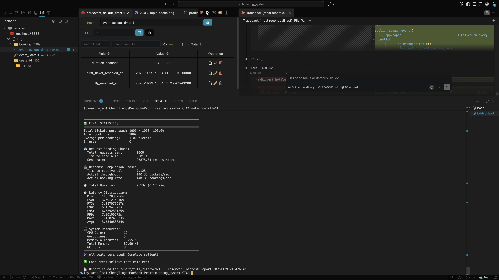
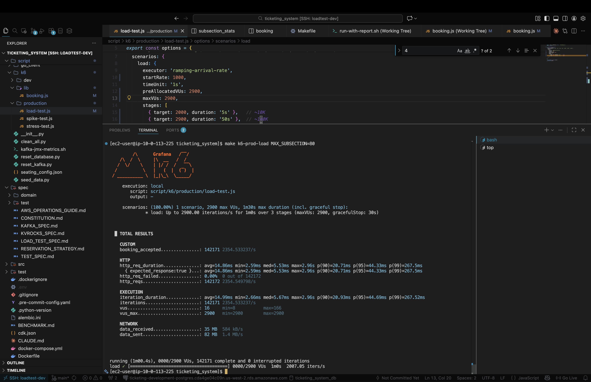
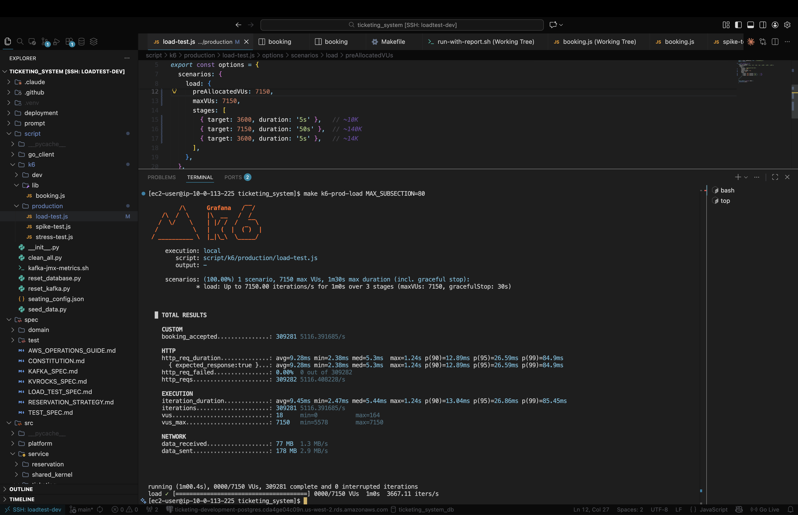

# Ticketing System

## Project Highlights

- Designed and implemented an **event-driven ticketing system** achieving **5,116 RPS** under load testing
- Leveraged **Kafka partition ordering** + **idempotency design** to achieve consistency without distributed locks
- Implemented **async booking notification** via SSE + Pub/Sub: API returns `202 Accepted` immediately, client receives real-time status updates
- Integrated **OpenTelemetry** with **Jaeger (local)** and AWS **X-Ray (cloud)** for distributed tracing
- Used **py-spy** to generate flame graphs, identified and resolved CPU bottlenecks in the hot path, reducing execution time by **72%**

---

## Project Goal

This project demonstrates a **Lock-Free Architecture** using **Kafka Partition** and **Consumer Group** characteristics to ensure data consistency under high concurrency without traditional distributed locks.

> **Note:** The following features are excluded from the scope:
>
> - Payment Processing
> - Timeout-based Cancellations

---

## Table of Contents

- [System Architecture](#system-architecture)
  - [Tech Stack](#tech-stack)
- [Idempotency Design](#idempotency-design)
  - [Kafka Partition Ordering](#1-kafka-partition-ordering)
  - [Reservation Flow](#2-reservation-flow)
    - [PostgreSQL Idempotency Check](#postgresql-idempotency-check)
    - [Kvrocks Idempotent Operations](#kvrocks-idempotent-operations)
- [Observability](#observability)
  - [Distributed Tracing: OpenTelemetry](#distributed-tracing-opentelemetry)
  - [CPU Profiling: py-spy](#cpu-profiling-py-spy)
- [Load Testing](#load-testing)
  - [Test Environment](#test-environment)
  - [Benchmark Results](#benchmark-results)

---

## System Architecture

```
┌────────┐      ┌─────────┐      ┌─────────────────┐      ┌─────────────┐      ┌─────────────────────┐
│ Client │─────▶│   ALB   │─────▶│    Ticketing    │─────▶│    Kafka    │─────▶│ Reservation Service │
└────────┘      └─────────┘      │    Service      │      │    (EC2)    │      │       (ECS)         │
     ▲                           │     (ECS)       │      └─────────────┘      └──────────┬──────────┘
     │                           └────────┬────────┘                                      │
     │                                    │                                      ┌────────┴────────┐
     │ SSE                                │                                      ▼                 ▼
     │                                    │                               ┌───────────┐    ┌───────────┐
     └────────────────────────────────────┘                               │  Aurora   │    │  Kvrocks  │
                                                                          │PostgreSQL │    │   (EC2)   │
                                                                          └───────────┘    └───────────┘
```

### Tech Stack

| Category           | Technology                         | Purpose                                 |
| ------------------ | ---------------------------------- | --------------------------------------- |
| **Language**       | Python 3.13                        | Runtime                                 |
| **Web Framework**  | FastAPI + Granian + uvloop         | High-performance async API              |
| **Database**       | RDS PostgreSQL                     | Persistent storage (booking, tickets)   |
| **Message Broker** | Kafka                              | Event streaming, At-Least-Once delivery |
| **Cache/State**    | Kvrocks (RocksDB + Redis protocol) | Seat bitmap, real-time state            |
| **Cloud**          | AWS (ECS, ALB, CDK)                | Infrastructure                          |
| **Observability**  | OpenTelemetry + Jaeger / X-Ray     | Distributed tracing                     |
| **Profiling**      | py-spy                             | CPU flame graph analysis                |

> **Why Kvrocks over Redis?**
> Redis 主要是 in-memory，雖然有 RDB/AOF 但仍可能丟失資料。Kvrocks 基於 RocksDB，資料直接寫入磁碟，crash 後不會遺失座位狀態。

---

## Idempotency Design

透過以下兩點設計確保冪等性：

1. **Kafka Partition Ordering** - 同一 Partition 只分配給同一 Consumer，確保順序處理
2. **Idempotent Operations** - PostgreSQL 狀態檢查 + Kvrocks BITFIELD SET 皆為冪等操作

### 1. Kafka Partition Ordering

同一區域的 Reserve/Release 發到同一 Partition，保證順序處理

**關鍵**: 同一 Consumer Group 內，一個 Partition 同時只會分配給一個 Consumer，確保順序處理

```
Topic: seat_reservation (Reserve + Release 都發到這裡)
    │
    ▼
Partition Key: {event_id}-{section}-{subsection}
    │
    ▼
Same Partition → Same Consumer → 順序處理

Reserve A-1 (t=1) → Release A-1 (t=2) → Reserve A-1 (t=3)
                    ↑
                    保證在 t=1 之後處理
```

**Message Commit（Offset Commit）**:

- Consumer 處理完訊息後 commit offset，確認已處理
- Commit 前 crash → 訊息重新傳遞 → 需要冪等操作

### 2. Idempotent Operations

```
SeatReservationUseCase.reserve_seats(request)
    │
    ├── [Step 1] Idempotency Check（PostgreSQL）
    │       ├── SELECT * FROM booking WHERE id = {booking_id}
    │       ├── FAILED → 返回錯誤
    │       └── PENDING_PAYMENT → 跳到 Step 4（確保 Kvrocks + SSE 完成）
    │
    ├── [Step 2] Find Best Available Seats（Kvrocks）
    │       └── BITFIELD GET 批次讀取座位狀態 → 返回 seats[]
    │
    ├── [Step 3] PostgreSQL Write
    │       ├── INSERT booking (status=PENDING_PAYMENT)
    │       └── UPDATE tickets SET status=RESERVED
    │
    └── [Step 4] Kvrocks Set Seats
            └── BITFIELD SET u1 seat_index 1（冪等：SET 1 = no-op）
```

#### PostgreSQL: Booking Status Check

booking_id (UUID7) 由 Client 產生，作為 Idempotency Key

```
SELECT * FROM booking WHERE id = {booking_id}
  │
  ├── 不存在 → 正常處理
  ├── FAILED → 返回錯誤（不重複建立）
  └── PENDING_PAYMENT → 跳過 DB 寫入，只完成 Kvrocks + SSE
```

#### Kvrocks: BITFIELD SET

BITFIELD SET 是冪等操作，重複執行不改變結果

```
BITFIELD SET u1 seat_index 1
  → 座位已是 1？SET 1 = no-op（冪等）

BITFIELD SET u1 seat_index 0
  → 座位已是 0？SET 0 = no-op（冪等）
```

---

## Observability

### Distributed Tracing: OpenTelemetry

Integrated **OpenTelemetry** for end-to-end distributed tracing across services.

**Exporters:**

| Environment | Exporter |
| ----------- | -------- |
| Local       | Jaeger   |
| AWS         | X-Ray    |

### CPU Profiling: py-spy

Used **py-spy** to generate flame graphs and identify CPU bottlenecks in the API hot path.

### Bottleneck Identified



**Bottleneck call stack:**

```text
publish_domain_event()                                    33.84%
  └── app.topic()                                         33.70%  ← Called on every publish
        └── TopicManager.topic()                          33.29%
              └── _get_or_create_broker_topic()           33.29%
                    └── _fetch_topic()                    33.01%
                          └── inspect_topics()            27.12%
                                └── list_topics()         27.12%  ← Queries Kafka metadata
                                      └── AdminClient.list_topics()  20.68%
                                            └── __init__()            15.75%
```

| Rank | Function                      | Samples | CPU %      | Root Cause                             |
| ---- | ----------------------------- | ------- | ---------- | -------------------------------------- |
| 1    | `quixstreams/app.topic()`     | 246     | **33.70%** | Calls `list_topics()` on every publish |
| 2    | `list_topics()` (admin.py)    | 198     | **27.12%** | Queries Kafka cluster metadata         |
| 3    | `confluent_kafka list_topics` | 151     | **20.68%** | Underlying Kafka client call           |

### Fix Applied

**Root Cause:** `app.topic()` calls `list_topics()` on every publish to verify topic exists → expensive Kafka metadata query

**Solution:** Cache Topic objects after first creation

```python
# event_publisher.py - Topic caching
_quix_topic_object_cache: dict[str, Any] = {}

def _get_or_create_quix_topic_with_cache(topic_name: str):
    """Cache Topic objects to avoid repeated list_topics() calls (~34% CPU)"""
    if topic_name not in _quix_topic_object_cache:
        app = _get_quix_app()
        _quix_topic_object_cache[topic_name] = app.topic(
            name=topic_name,
            key_serializer='str',
            value_serializer='json',
        )
    return _quix_topic_object_cache[topic_name]
```

### Performance Validation (go-spike-test)

> **Architecture Note:** This system uses **Response-First** pattern. The API responds immediately after publishing to Kafka (`202 Accepted`), actual seat reservation and booking creation happen asynchronously via consumers.

#### Before Optimization



#### After Topic Caching


#### Performance Comparison

| Metric                  | Before | After Topic Cache | Improvement |
| ----------------------- | ------ | ----------------- | ----------- |
| **Sellout Duration** ¹  | 13.91s | 3.31s             | **76.2% ↓** |
| **Response Duration** ² | 7.13s  | 3.33s             | **53.3% ↓** |
| **P50**                 | 3.59s  | 1.84s             | **48.7% ↓** |
| **P95**                 | 6.54s  | 3.14s             | **52.0% ↓** |
| **P99**                 | 7.00s  | 3.30s             | **52.9% ↓** |
| **Throughput**          | 140/s  | 300/s             | **2.1× ↑**  |

> ¹ **Sellout Duration**: Time from first ticket reserved to all 1000 tickets sold (end-to-end, includes async consumer processing)
>
> ² **Response Duration**: Time for all 1000 HTTP requests to receive responses (API layer only)

**Conclusion:** Topic caching optimization reduced sellout time from **13.91s → 3.31s** (76% faster) and increased throughput from **140/s → 300/s** (2.1×)

---

## Load Testing

### Test Environment

| Component           | Local (MacBook Pro M2 Max) | AWS Cloud (Development)             |
| ------------------- | -------------------------- | ----------------------------------- |
| PostgreSQL          | Docker                     | RDS db.c6gd.2xlarge (8 vCPU, 32 GB) |
| Kafka               | 3 brokers (Docker)         | 3× c7g.large EC2 (2 vCPU, 4 GB)     |
| Kvrocks             | Docker                     | m6i.large EC2 (2 vCPU, 8 GB)        |
| Ticketing Service   | 5 instances                | ECS Fargate (2 vCPU, 4 GB)          |
| Reservation Service | 5 instances                | ECS Fargate (2 vCPU, 4 GB)          |

### Benchmark Results

#### Spike Test (Sellout 2000 Tickets)

| Environment                  | Avg Time | TPS  | vs Local |
| ---------------------------- | -------- | ---- | -------- |
| Local                        | 1.33s    | 1504 | 100%     |
| RDS Single-AZ (m8gd.2xlarge) | 2.31s    | 866  | 58%      |
| RDS Multi-AZ (m8gd.2xlarge)  | 3.45s    | 580  | 39%      |

#### Sustained Load Test (k6, 0% Error Rate)

| Environment      | RPS   | avg     | p95      | p99      |
| ---------------- | ----- | ------- | -------- | -------- |
| Local            | 1,145 | 30.51ms | 121.23ms | 247.18ms |
| ECS (10i/20vCPU) | 2,355 | 14.86ms | 44.33ms  | 267.5ms  |
| ECS (25i/50vCPU) | 5,116 | 9.28ms  | 26.59ms  | 84.9ms   |






**Key Findings:**

- Cloud environment ~74% slower than local due to network RTT
- Multi-AZ replication costs 33% TPS (866 → 580)
- TPS remains stable (~880) across 2K/5K/10K ticket volumes
- Bottleneck is network layer

### Distributed Tracing Analysis

Traces confirm the bottleneck is **network RTT**:

| Metric                                 | Local  | Cloud | Description                              |
| -------------------------------------- | ------ | ----- | ---------------------------------------- |
| **Total Trace**                        | 2.53s  | 3.8s  | End-to-end (API → Kafka → Consumer → DB) |
| `consumer...ticket-command-request...` | 2.46ms | ~10ms | Consumer actual processing time          |
| `repo.create_booking_with_tickets`     | 1.03ms | ~4ms  | PostgreSQL write (booking + tickets)     |

> **Insight**: Consumer processing 10ms (includes DB write), but total trace is 3.8s → **99.7% is Kafka queue wait time**

**Example Trace (Jaeger - Booking → Reservation, 2.53s):**


**Example Trace (X-Ray - Booking → Reservation, 3.8s):**


> See [BENCHMARK.md](BENCHMARK.md) for detailed analysis
