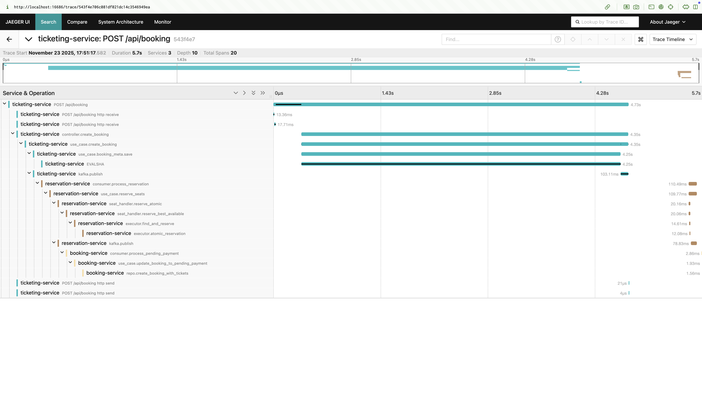
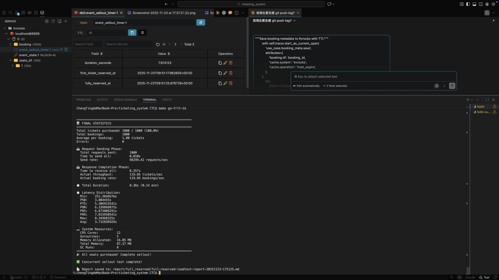

# Ticketing System

## Project Highlights

- Designed and implemented an **event-driven ticketing system** using Hexagonal Architecture, achieving **5,116 RPS** under load testing
- Built async seat reservation with **SAGA pattern** for distributed transactions across Kafka, Kvrocks, and PostgreSQL
- Achieved **consistency** via Kafka partition ordering + idempotency check
- Integrated **OpenTelemetry** with **Jaeger (local)** and AWS **X-Ray (cloud)** for distributed tracing
- Used **py-spy** to generate flame graphs, identified and resolved CPU bottlenecks in the hot path, reducing execution time by **72%**


---

### After: 50 Consumers × 0.1 CPU (Total: 5 CPU reserved)

```yaml
resources:
  limits:
    cpus: "0.25"
    memory: 512M
  reservations:
    cpus: "0.1"
    memory: 128M
```

**Result (longest trace):** Producer → Consumer latency: **~1 second** (4.35s ~ 5.53s)




---

## CPU Profiling with py-spy

Used **py-spy** to generate flame graphs and identify CPU bottlenecks in the API hot path.

### Setup

```dockerfile
# Dockerfile (development stage)
RUN uv sync --all-groups --frozen && \
    pip install py-spy
```

```yaml
# docker-compose.yml
ticketing-service:
  cap_add:
    - SYS_PTRACE # Required for py-spy profiling
```

### Profiling Commands

```bash
# Enter container
docker exec -it <container> bash

# Find Python process
ps aux | grep python

# Generate flame graph (30 seconds sampling)
py-spy record -o /tmp/profile_$(date +%Y%m%d_%H%M%S).svg --pid <PID> --duration 30

# Copy out
docker cp <container>:/tmp/profile_*.svg ./observability/profiling/
```

### Bottlenecks Identified (from Flame Graph - Before Fix)


**Biggest bottleneck call stack:**

```text
publish_domain_event()                                    33.84%
  └── app.topic()                                         33.70%  ← Called on every publish
        └── TopicManager.topic()                          33.29%
              └── _get_or_create_broker_topic()           33.29%
                    └── _fetch_topic()                    33.01%
                          └── inspect_topics()            27.12%
                                └── list_topics()         27.12%  ← Queries Kafka metadata
                                      └── AdminClient.list_topics()  20.68%
                                            └── __init__()            15.75%
```

**Loguru file sink bottleneck:**

```text
loguru/_handler.py:emit()                                 15.75%
  └── _queued_writer()                                    15.75%  ← Async queue processing
        └── _file_sink.py:write()                          9.86%  ← File I/O blocking
              └── open().write()                           9.86%
```

| Rank | Function                            | Samples | CPU %      | Root Cause                             |
| ---- | ----------------------------------- | ------- | ---------- | -------------------------------------- |
| 1    | `quixstreams/app.topic()`           | 246     | **33.70%** | Calls `list_topics()` on every publish |
| 2    | `list_topics()` (admin.py)          | 198     | **27.12%** | Queries Kafka cluster metadata         |
| 3    | `confluent_kafka list_topics`       | 151     | **20.68%** | Underlying Kafka client call           |
| 4    | `loguru/_handler.py:_queued_writer` | 115     | **15.75%** | Log queue processing                   |
| 5    | `loguru/_file_sink.py:write`        | 72      | **9.86%**  | File I/O blocking                      |

### Fixes Applied

| Bottleneck    | CPU % | Fix                                               | Result                                               |
| ------------- | ----- | ------------------------------------------------- | ---------------------------------------------------- |
| `app.topic()` | ~34%  | Cache Topic objects in `_quix_topic_object_cache` | Eliminates repeated `list_topics()` calls            |
| File logging  | ~25%  | Disable file sink in production (`DEBUG=false`)   | Use stdout only, collected by CloudWatch/Docker logs |

### Implementation

```python
# event_publisher.py - Topic caching
_quix_topic_object_cache: dict[str, Any] = {}

def _get_or_create_quix_topic_with_cache(topic_name: str):
    """Cache Topic objects to avoid repeated list_topics() calls (~34% CPU)"""
    if topic_name not in _quix_topic_object_cache:
        app = _get_quix_app()
        _quix_topic_object_cache[topic_name] = app.topic(
            name=topic_name,
            key_serializer='str',
            value_serializer='json',
        )
    return _quix_topic_object_cache[topic_name]
```

```python
# loguru_io_config.py - Conditional file logging
if settings.DEBUG:
    custom_logger.add(file_sink, ...)  # Only in development
```

### Architecture Decision

- **Development**: `DEBUG=true` → File logging enabled (convenient for local debugging)
- **Production**: `DEBUG=false` → Stdout only (logs still persisted via CloudWatch/Loki/Docker json-file driver)

---

### Before vs After Comparison

| Function                        | Before                   | After                 | Improvement |
| ------------------------------- | ------------------------ | --------------------- | ----------- |
| `publish_domain_event` total    | 247 samples (**33.84%**) | ~15 samples (**~4%**) | **88% ↓**   |
| ├─ `quixstreams/app.topic()`    | 246 samples (**33.70%**) | 6 samples (**1.51%**) | **95.5% ↓** |
| │ └─ `list_topics()`            | 198 samples (**27.12%**) | 0 samples (**0%**)    | **100% ↓**  |
| └─ `loguru/_file_sink.py:write` | 72 samples (**9.86%**)   | 0 samples (**0%**)    | **100% ↓**  |

**Key Observations:**

1. **Topic Caching Works**: `app.topic()` dropped from 33.70% → 1.51% (only called on cache miss)
2. **list_topics() Eliminated**: No longer called on every publish (0% CPU)
3. **File Logging Disabled**: `_file_sink.py:write` completely eliminated in `DEBUG=false` mode
4. **CPU Now Spent on Business Logic**: Top consumers are now `solve_dependencies` (18%), `start_span` (15%), `save_booking_metadata` (8%)

---

### Spike Test Results (1000 Concurrent Requests)

> **Architecture Note:** This system uses **Response-First** pattern. The API responds immediately after publishing to Kafka (`202 Accepted`), actual seat reservation and booking creation happen asynchronously via consumers. Throughput measures API response speed, not end-to-end processing.

#### Step 1: Before Optimization


#### Step 2: After Topic Caching


#### Step 3: After Logging Optimization (DEBUG=false)


#### Performance Comparison

| Metric                  | Before | + Topic Cache | + Logging Off | Total Improvement |
| ----------------------- | ------ | ------------- | ------------- | ----------------- |
| **Sellout Duration** ¹  | 13.91s | 3.31s         | **2.53s**     | **81.8% ↓**       |
| **Response Duration** ² | 7.13s  | 3.33s         | **1.08s**     | **84.9% ↓**       |
| **P50**                 | 3.59s  | 1.84s         | **575ms**     | **84.0% ↓**       |
| **P95**                 | 6.54s  | 3.14s         | **994ms**     | **84.8% ↓**       |
| **P99**                 | 7.00s  | 3.30s         | **1.06s**     | **84.9% ↓**       |
| **Throughput**          | 140/s  | 300/s         | **930/s**     | **6.6× ↑**        |

> ¹ **Sellout Duration** (`duration_seconds`): Time from first ticket reserved to all 1000 tickets sold (end-to-end, includes async consumer processing)
>
> ² **Response Duration**: Time for all 1000 HTTP requests to receive responses (API layer only)

#### Incremental Gains

| Optimization  | Sellout | Response | P95   | Throughput | Gain                   |
| ------------- | ------- | -------- | ----- | ---------- | ---------------------- |
| Baseline      | 13.91s  | 7.13s    | 6.54s | 140/s      | -                      |
| + Topic Cache | 3.31s   | 3.33s    | 3.14s | 300/s      | **76% faster sellout** |
| + Logging Off | 2.53s   | 1.08s    | 994ms | 930/s      | **24% faster sellout** |

**Conclusion:** Two simple optimizations reduced sellout time from **13.91s → 2.53s** (82% faster), response time from **7.13s → 1.08s** (85% faster), and increased throughput from **140/s → 930/s** (6.6×)
